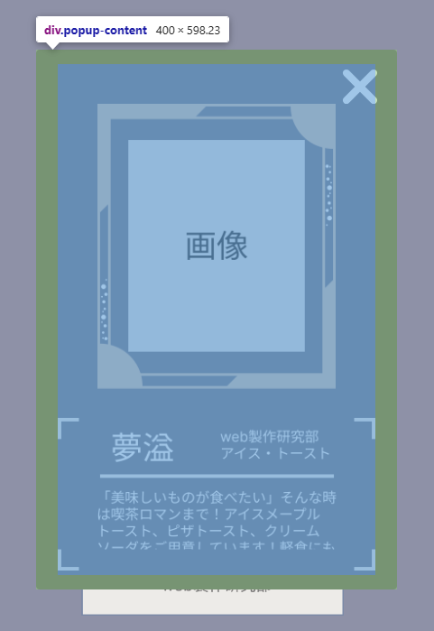

# What is this?
2025年明石高専祭「夢溢」の公式Webサイトに使用するUIコンポーネント等を一部公開しているリポジトリです。
実験的にWeb Componentsを使用しています。
理由としては、JavaScriptをほとんど触ったことのない初心者のコーダーでもUIを扱いやすいようにしつつ、DOM操作等のロジックを隠蔽するのに適していると考えたためです。

# Components
予定ではそこまで数は増えませんが、いくつかのコンポーネントを公開しています。

コンポーネントを使い始める方は、[導入の仕方](./docs/how-to-introduce.md)をご参照ください。

## Popup
### Overview
- PopupWrapper: ポップアップのラッパーコンポーネント
- PopupOpener: ポップアップを開くためのトリガーコンポーネント



上の画像のように、PopupWrapperはポップアップのコンテンツ領域に適切なパディングを持たせるためのスタイルを提供します。
また、ポップアップの開閉に関するロジックやUIは全てPopupOpenerが担います。
例えば、バツアイコンは実装者が用意する必要はなく、PopupOpenerコンポーネントが提供します。


上の画像のように、PopupOpenerはフォーカス可能な要素であり、マウスクリックはもちろんのことキーボード操作でもポップアップを開くことができます。
このフォーカス時のスタイル以外は付与されていないため、実装者はこのコンポーネント内部のUIを自由に構築できます。


### How to use
以下は、`PopupWrapper` と `PopupOpener` を使った基本的な利用例です。

```html
<!-- ポップアップを開くボタン -->
<popup-opener>
	<p>ポップアップを開く</p>
</popup-opener>

<!-- ポップアップ本体 -->
<popup-wrapper>
	<h2>ポップアップのタイトル</h2>
	<p>ここにポップアップの内容を書きます。</p>
</popup-wrapper>
```

- `<popup-opener>` の中に、任意のボタンや要素を入れることで、クリックやキーボード操作でポップアップを開けます。
- `<popup-wrapper>` の中に、表示したい内容を自由に記述できます。
- ポップアップの開閉やバツアイコンなどのUIはコンポーネントが自動で提供します。

またこれらのコンポーネントを使うには、事前にJavaScriptファイルを読み込む必要があります。
```html
<script type="module" src="./components/popup.js"></script>
```

